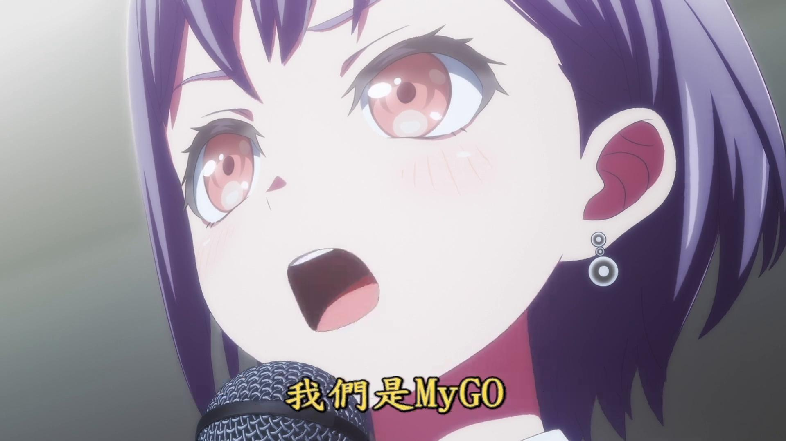

# MyGO!!!!! Bot - Telegram Image Search Bot



A Telegram bot built with [Grammy](https://grammy.dev/) and [Hono](https://hono.dev/) that allows users to search for MyGO!!!!! images by keywords. This bot is designed to be deployed on Cloudflare Workers, leveraging edge computing capabilities for fast responses.

## Features

- Search for MyGO!!!!! images by keywords
- View images directly in Telegram
- Interactive button interface for search results
- Optimized for edge deployment on Cloudflare Workers
- Uses Grammy framework for Telegram bot functionality
- Uses Hono framework for efficient request handling

## About MyGO!!!!!

MyGO!!!!! is a fictional band from the BanG Dream! franchise. The anime "BanG Dream! It's MyGO!!!!!" began airing on June 29, 2023, and focuses on the formation and journey of the band. The story follows Chihaya Anon, who transfers to Haneoka Girls' High School and wants to start a band to fit in. She recruits Takamatsu Tomori (nicknamed "Haneoka's Weirdo") and other members to form MyGO!!!!!

## Prerequisites

- Node.js (v18 or later)
- Cloudflare account
- Telegram Bot Token (from [@BotFather](https://t.me/BotFather))
- Cloudflare R2 or other image hosting service

## Setup

1. Clone this repository
2. Install dependencies:

```bash
npm install
```

3. Set your environment variables in Cloudflare Workers:

```bash
wrangler secret put BOT_TOKEN
wrangler secret put IMAGE_HOST
```

Or for local development, create a `.dev.vars` file (this file should be added to `.gitignore`):

```
BOT_TOKEN="your_telegram_bot_token"
IMAGE_HOST="https://your-image-host.example.com"
```

## Development

To run the bot locally for development:

```bash
npm run dev
```

## Deployment

To deploy the bot to Cloudflare Workers:

```bash
npm run deploy
```

After deployment, you need to set up a webhook for your Telegram bot. Replace `YOUR_WORKER_URL` with your actual Cloudflare Worker URL:

```
https://api.telegram.org/bot<YOUR_BOT_TOKEN>/setWebhook?url=YOUR_WORKER_URL/webhook
```

## Usage

Once the bot is deployed and the webhook is set up, users can interact with it on Telegram:

- `/start` - Get a welcome message
- `/help` - Get help on how to use the bot
- Send any keyword to search for matching MyGO!!!!! images
- Click on search results to view the full image

## Data Source

The bot uses data from the MyGO!!!!! anime series, with images hosted on a Cloudflare R2 storage bucket or similar service.

## License

MIT
